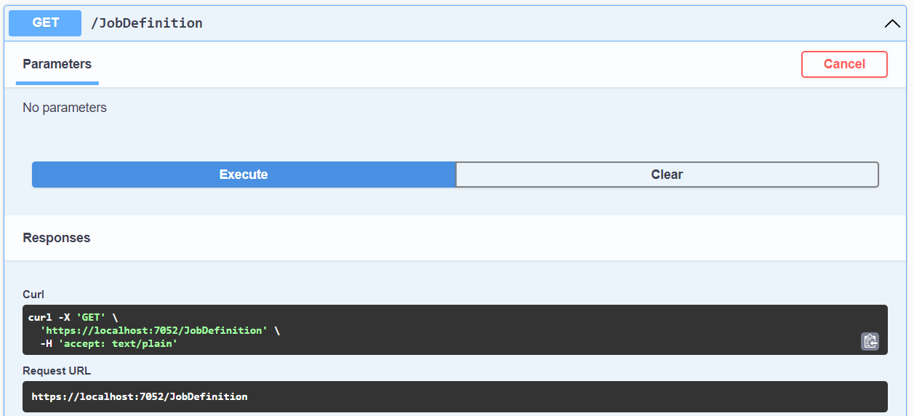

# **Setup**

make new ASP.NET Core WebAPI project with:  
```
dotnet new webapi
```

or from Visual Studio:


# **Code stuff**
```C#
var builder = WebApplication.CreateBuilder(args);
...

// inject DI like this
builder.Services.AddTransient<Class1>();
builder.Services.AddSingleton<Class2>();

...

var app = builder.Build();

// add middlewares
app.UseHttpsRedirection();
app.UseMiddleWare(...); // use custom middleware, idk how to make one ngl

app.Run(); // runs the webApp and blocks the thread
```

## **Running**
`cd` to the project folder and `dotnet run`


> the address root will not return anything, try the routes. 


## **Routing** 
```C#
// not sure if this is needed ngl
namespace webApiTest.Controllers; 

[Route("[controller]")]
[ApiController]
public class ResourceController : ControllerBase
{
    [HttpPost]
    public ActionResult Add(Resource thingToAdd)
    { ... }

    [HttpGet]
    public ActionResult<IEnumerable<Resource>> GetAll() 
    { ... }

    [HttpGet("{name}")]
    public ActionResult<Resource> Get(string name) 
    { ... }
}
```

|||
|-|-|
|**`GET`** `address:port/resource` |returns `ResourceController.GetAll()`|
|**`GET`** `address:port/resource/foobar` |returns `ResourceController.Get("foobar")`|
|**`POST`** `address:port/resource` |returns `ResourceController.Add(data)`<br> `data` is automatically serialized from the `curl -d` parameter|

# Useful tools - swagger

make use of swagger
```C#
if (app.Environment.IsDevelopment())
{
    app.UseSwagger();
    app.UseSwaggerUI();
}
```
run the project and go to `address/swagger`



you can test the api endpoints here and check their corresponding **`curl`** commands and url


**`curl`** is useful for automation ata.


